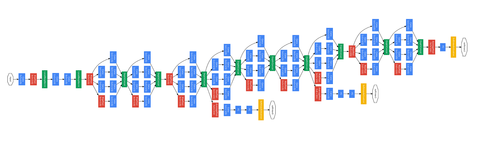

```{r global-options, include=FALSE}
knitr::opts_chunk$set(echo = FALSE)
library(tidyverse)
library(tidymodels)
library(kableExtra)
library(neuralnet)
library(patchwork)
```

**Purpose:** This notebook covers several common deep learning architectures. In particular, we will see architectures for:

+ Linear Regression as a Neural Network
+ Logistic Regression as a Neural Network
+ Deep Learning Neural Networks
+ Recurrent Neural Network and Long Short-Term Memory Networks
+ Convolutional Neural Networks
+ Autoencoders

We'll also discuss use-cases for each of these types of network.

## About this Notebook

I intend for this topic (and the next one) to be in-class discussions. As such, the prepared notes here will be quite limited.

## Generating Toy Data

We'll generate a toy data set that includes both a numerical and categorical response variable along with three predictors.

```{r}
num_obs <- 1e4
toy_data <- tibble(x1 = runif(num_obs, 0, 10),
                   x2 = runif(num_obs, 0, 10),
                   x3 = runif(num_obs, 0, 10))
toy_data <- toy_data %>%
  mutate(num_response = 5*x1 + 10*x2 - x1*x2 + rnorm(num_obs, 0, 5)) %>%
  mutate(cat_response = ifelse(2*x1 - 3*x2 + rnorm(num_obs, 0, 15) >= 0, 1, 0))

toy_data %>% 
  head() %>%
  kable() %>%
  kable_styling(bootstrap_options = c("hover", "striped"))
```

## Linear Regression as a Neural Network

Linear regression can be achieved as a neural network with no hidden layers. It will have an input layer with a node for each of the available predictors and a single output node. Each of the input nodes will be linked to the output node via a weighted edge whose weight is the linear regression coefficient for that predictor. There will also be a *bias* which serves as the linear regression intercept. 

```{r}
linear_reg_nn <- neuralnet(num_response ~ x1 + x2 + x3, 
                           data = toy_data,
                           hidden = 0)
plot(linear_reg_nn, rep = "best")
```
Notice that the weightings on the edges of the network are the same as the learned coefficients for the corresponding linear regression model. Indeed, we'll fit the linear regressor using `{tidymodels}` and examine its coefficients.

```{r}
lin_reg_spec <- linear_reg() %>%
  set_engine("lm")
lin_reg_rec <- recipe(num_response ~ x1 + x2 + x3, 
                      data = toy_data)
lin_reg_wf <- workflow() %>%
  add_model(lin_reg_spec) %>%
  add_recipe(lin_reg_rec)

lin_reg_fit <- lin_reg_wf %>%
  fit(toy_data)
lin_reg_fit %>%
  extract_fit_engine() %>%
  tidy() %>%
  kable() %>%
  kable_styling(bootstrap_options = c("hover", "striped"))
```

## Logistic Regression as a Neural Network

Similar to linear regression, logistic regression can be achieved as a neural network. There will be no hidden layers. Each predictor will be assigned a weight (coefficient), and there will be a bias (intercept). 

```{r}
logistic_reg_nn <- neuralnet(cat_response ~ x1 + x2 + x3, 
                           data = toy_data,
                           hidden = 0,
                           linear.output = FALSE,
                           err.fct = "ce")
plot(logistic_reg_nn, rep = "best")
```

Again, this network is the same as the corresponding logistic regression model. We can verify this by fitting that model using `{tidymodels}` and viewing the fitted coefficients.

```{r}
log_reg_spec <- logistic_reg()
log_reg_rec <- recipe(cat_response ~ x1 + x2 + x3, 
                      data = toy_data) %>%
  step_mutate(cat_response = as.factor(cat_response))
log_reg_wf <- workflow() %>%
  add_model(log_reg_spec) %>%
  add_recipe(log_reg_rec)

log_reg_fit <- log_reg_wf %>%
  fit(toy_data)
log_reg_fit %>%
  extract_fit_engine() %>%
  tidy() %>%
  kable() %>%
  kable_styling(bootstrap_options = c("hover", "striped"))
```

Here the coefficients of the logistic regression model are similar but not identical the weights in the neural network. There is one additional intricacy here in how the weighted predictor values and bias are converted into a response for a neural network. There is the presence of an activation function which may perform an additional transformation prior to prediction (actually, there are likely to be lots of activation functions throughout the notebook). We'll discuss activation functions in the next notebook.

## Deep Learning Networks

The previous examples of linear regression and logistic regression as networks are useful in gaining some intuition as to what neural networks are, but they aren't practical. Neural networks typically have at least one hidden layer -- that is, a transformation layer between the input layer and the output layer. These layers can take lots of forms and they'll largely dictate the type of network you are constructing. We'll discuss types of layers shortly, but for now we'll simply state that deep learning networks typically have at least two hidden layers.

Below are two neural networks. The first has a single hidden layer with four neurons, while the second network has two hidden layers with four neurons each. Generally these hidden layers may have many neurons (32 or more). Powers of two seem like common choices for the number of neurons in a hidden layer.

```{r echo = FALSE, message = FALSE}
nn1 <- neuralnet(num_response ~ x1 + x2 + x3,
                 data = toy_data,
                 hidden = 4,
                 err.fct = "sse",
                 threshold = 1e3)
nn2 <- neuralnet(num_response ~ x1 + x2 + x3,
                 data = toy_data,
                 hidden = c(4, 4),
                 err.fct = "sse",
                 threshold = 1e3)
par(mfrow = c(1, 2))
plot(nn1, rep = "best")
plot(nn2, rep = "best")
par(mfrow = c(1, 1))
```

The networks above use fully connected (*dense*) hidden layers. This means that every neuron from the previous layer is connected to every neuron in the current layer. These *dense* layers are only one type of layer which we have access to when constructing these networks.

***Note:*** The networks shown here have not been optimized. Parameters for these networks have been set so that the network training would be stopped very early in order for the notebook to render relatively quickly.

## Special Classes of Network

What has been described up to this point are basic neural networks for use in regression and classification applications. We can build more purposeful architectures with special classes of hidden layer to perform more nuanced tasks. In particular, we may want to build a network that includes recurrent layers for working with time series data or we may want to use convolutional layers for working on image classification problems.

We'll discuss those specific layer classes and architectures in class.

## Summary

We've gotten a basic introduction to architectures for deep learning networks in this notebook. Hopefully the discussions here have been helpful for building your intuition regarding what a large-scale neural network may look like.

<center> </center>

